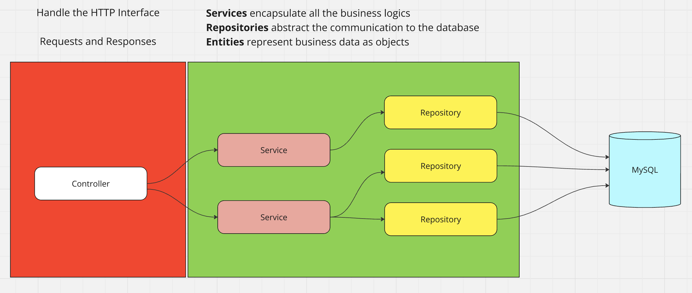

# Architecture

## The model
Object Oriented Programming is used as the basic aspects of this architecture

 

The architecture implemented was inspired in Domain Driven Design where the Domain layer encapsulates all business logics. In this case there is not a strict segreation between the domain and the reset of the application but the image explains how the layers talk to each other. See below a more detailed description.

|  |  |
|----------|----------|
|   <b>Controller</b>  |   Creates an interface between the application and the external world. In this case HTTP requests. So It is responsible for gathering all HTTP data including headers, url parameters, get and post data and so on.   However, It does not know anything about the business logic. It will always call a <b>Service<b/> for it  |
|   <b>Service</b>  |   It is responsible for managing all business needs. All actions necessary to be performed will be processed by a Service with no exceptions. A Service does not know how to talk to the Database though.  |
|   <b>Repository</b>  |   It is a abstraction layer to perform database transactions  |
|   <b>Entity</b>  |   It represents a business data. By creating classes to represent the data, we get a much safer data manipulation because the class will handle theier own minimum validation. |
